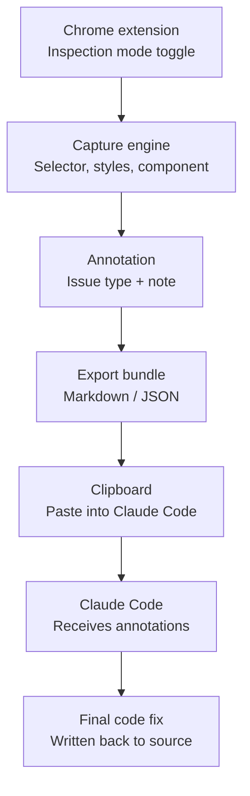

# SpotCheck

A Chrome extension that lets you click an element on a running web page, tag what's wrong with it, and export a structured bundle that Claude Code (or another coding agent) can act on directly — no more manually describing "the second child under the third div."

---

## 1. The problem

When people give AI coding agents feedback on a UI ("the spacing here is off," "this button doesn't do anything"), the agent has to guess which DOM element is meant from a text description alone. That guess is often wrong, especially in nested or repeated component structures. Click-to-select removes that ambiguity at the source: the user points, the tool captures exactly which node they meant.

## 2. Scope decision: v1 is Chrome only

Other browsers (Firefox, Safari, Edge) are not architecturally hard to support later — the underlying technique (an injected content script reading the live DOM) is part of the standard WebExtensions API that all of them implement, with minor manifest differences. A desktop app was also considered and set aside: it would mean bundling or embedding a browser (e.g. via Electron) instead of injecting into the browser the user already has open, which is a lot of added complexity for no real benefit at this stage.

**Decision: build for Chrome first, treat cross-browser as a straightforward later port, not a redesign.**

## 3. Architecture (v1)



*(v1 Feature 3 originally called this step "Preset tag + note," then descoped to free-text-only and deferred the preset-tag idea to Phase 2 — see §8. v2's Feature 5 built exactly that deferred idea: a grouped Issue-type dropdown, single-select, no separate note requirement. The diagram above reflects what's actually in the code today, not the v1-era label.)*

*(Phase 2 items — local MCP server, live DevTools verification — are shown separately in the roadmap section, not part of this v1 diagram.)*

## 4. v1 feature breakdown

Each numbered feature below has its own `plan.md` (concrete implementation steps for an AI coding agent — files, functions, order, test criteria) and `spec.md` (technical reference — what it does, how it works, feature-specific guardrails, relevance to other features), kept in a `feature-N-<name>/` folder.

1. **Inspection Mode / Element Picker** — toggleable hover+click DOM picker. Hover highlights elements; click drills down to the precise child element, same interaction model as browser DevTools' element picker.
2. **Capture Engine** — for the selected element, grabs CSS selector path, computed styles relevant to the chosen tag, and component name if detectable (React/Vue devtools hooks, data attributes, or nearest identifiable ancestor).
3. **Annotation Layer** — popup/sidebar for a free-text note (a preset tag was originally planned here; descoped to free-text-only for v1 and revisited in v2's Feature 5 — see §8). Supports queuing multiple annotations before a single export.
4. **Export Bundle** — serializes all queued annotations into one structured Markdown/JSON block, copies to clipboard. **v1: clipboard only** — no server, no network call, nothing running in the background.

## 5. Why click-to-select over agent-driven inspection

We looked at just handing an agent DevTools MCP and letting it inspect the page itself, rather than capturing user clicks. Rejected for v1: the agent would still have to *infer* which element the user's text description refers to, which reintroduces the exact ambiguity this tool exists to remove. Click-to-select keeps targeting deterministic; the agent only ever receives the tool's own precise selector, not a natural-language guess.

## 6. Security guardrails

Non-negotiable constraints on the implementation, not aspirations:

- **No embedded script in the target app.** The extension is injected on demand by the user toggling it on, the same as VisBug or the browser's own inspector. It is never added to the app's own source/build.
- **No network calls in v1.** Clipboard-only export means the extension never talks to any server, local or remote.
- **No persistent DOM access.** Inspection mode is off by default and only active while explicitly toggled on.
- **No credential or storage access.** Permissions scoped to only what's needed to read DOM structure and computed styles on the active tab — not cookies, local storage, or other tabs.
- **Read-only capture.** The extension observes and reads the DOM; it does not modify or inject content into the page being annotated (no live-preview-and-apply in v1).
- **When MCP is added later (Phase 2):** the local MCP server must bind to localhost only, require no external network exposure, and should be treated as a trust boundary. **Built as of v2's Feature 7** (`mcp-server/`) — this bullet's requirements are honored via Origin-header checks on both its HTTP endpoints plus the MCP SDK's own DNS-rebinding protection; see `docs/features/feature-7-local-mcp-server/spec.md`.

## 7. Prior art we drew on

| Tool | Relevant technique | What we took from it |
|---|---|---|
| **VisBug** (Google Chrome Labs) | On-demand injected content script, never embedded in app code | The core safety model for our extension architecture |
| **Agentation** | Click-to-annotate + structured export format (AFS), later added a local MCP server for direct agent fetch | Validated the "annotate → structured export → agent" flow works; we deliberately avoided its embedded-script installation model for security reasons |
| **Vibe Annotations** | Browser extension + separate local Node process: extension pushes annotations over plain HTTP to a local server, which persists to its own on-disk JSON file and exposes them via MCP-over-HTTP | This is what v2's Feature 7 is actually modeled on (push-not-pull, HTTP-not-stdio, persistent-process-not-spawned-per-session) — researched directly from their docs before writing that feature's spec, not guessed. See `docs/features/feature-7-local-mcp-server/spec.md`'s "Architecture decision" section. |
| **Markagent / DOM Review** | Click-to-select DOM element, export selector + component + file path as markdown for pasting into Claude Code/Cursor | Confirms the clipboard-paste-into-agent pattern is already a validated, working workflow elsewhere |
| **Chrome DevTools MCP** | Agent-driven browser control (screenshots, DOM snapshots, live script eval) via Puppeteer/CDP | Considered for user-click capture, rejected as unnecessarily complex for that purpose — kept in mind for Phase 2 live verification instead |
| **Claude Artifacts comments** | Element-anchored comments that Claude Code can read and act on | Shows Anthropic's own tooling already validates the comment-to-agent-fix loop conceptually |
| **tokeninspect** (own earlier repo) | Storybook manager-api panel displaying a manually-declared token list per story | Confirms that auto-mapping computed styles to design tokens is unsolved, unfinished prior art — a caution for Phase 3, not reusable code (Storybook-panel-specific, not a live-page architecture) |

## 8. Roadmap (not in v1 scope)

**DONE (v2, Feature 7) — Local MCP server export path.** In addition to clipboard copy, a small local MCP server (`mcp-server/`, localhost-only, no external exposure) that Claude Code can fetch annotations from directly, removing the manual copy/paste step. Modeled on **Vibe Annotations'** actual shipped architecture (researched directly, see §7), not Agentation as originally guessed here — push from the extension over plain HTTP, not a pull. Scoped down deliberately to two read-only tools (`list_annotations`, `get_annotation`); no resolve/reopen/dashboard yet, see the next item.

**Phase 2 — Live verification loop.** Once a first fix is generated, use Chrome DevTools MCP to let the agent apply a proposed change live in the browser and check the real computed result before writing final code. Only makes sense from the second iteration onward — the first pass has no "before" state to verify against. Feature 7 deliberately left the resolve/reopen tool contract and any queue dashboard out of scope so this remains a clean, separate addition to the same MCP server rather than something retrofitted.

**DONE (v2, Feature 5) — Preset annotation tags, in a different shape than originally imagined.** Feature 3's original design called for a preset tag (spacing, color, wrong token, broken interaction, other) alongside the free-text note; v1 shipped free-text notes only. v2's Feature 5 (per an actual Figma design, not a guessed category list) built a grouped single-select Issue-type dropdown — a `Property` group (Color/Typography/Spacing/Layout) and a `Structure` group (Component/Component Variant/State-Interaction/Other) — which now doubles as this. See `docs/features/feature-5-ui-makeover/spec.md`'s "Current Issue type model."

**Not yet started — Component Name Extraction (Feature 8).** Queued next in the v2 build sequence (5→6→7→8); not begun as of this writing.

**Phase 3 — Figma design QA mode.** When a Figma file exists for the product, add a mode that pulls structured Figma node/token data (via the Figma MCP server) plus screenshots, and speculatively flags likely divergences between the live-coded UI and the design spec — button padding drifted from the token, a component using the wrong color variable, etc. This is explicitly **not** full automated visual regression testing (tools like Applitools or Percy already do that well). Instead: the AI flags *candidate* issues, the user confirms which ones are real via a simple checklist UI, and only confirmed issues get sent to Claude for a fix — because not everything in a design translates cleanly to code (e.g. fixed pixel grids becoming responsive percentage layouts), so a human confirmation step avoids false-positive noise. **Known hard problem:** mapping a rendered element's computed styles back to design tokens automatically is unsolved based on prior experimentation — plan for this accordingly, not as a trivial lookup.

---

## Repo layout

```
spotcheck/
├── PROJECT.md                     ← this file
├── CLAUDE.md                      ← agent-facing instructions for working in this repo
├── CHROMEWEBSTORE.md              ← Chrome Web Store submission reference (not yet submitted)
├── docs/
│   └── features/
│       ├── feature-1-inspection-mode/          { plan.md, spec.md }
│       ├── feature-2-capture-engine/           { plan.md, spec.md }
│       ├── feature-3-annotation-layer/         { plan.md, spec.md }
│       ├── feature-4-export-bundle/            { plan.md, spec.md }
│       ├── feature-5-ui-makeover/              { plan.md, spec.md }
│       ├── feature-6-annotation-capture-edit/  { plan.md, spec.md }
│       └── feature-7-local-mcp-server/         { plan.md, spec.md }
├── extension/                      ← the Chrome extension itself; this is what gets ZIPed for the Web Store
│   ├── manifest.json
│   ├── background.js
│   └── content/
│       ├── state.js
│       ├── overlay.js
│       ├── picker.js
│       ├── capture.js
│       ├── queue.js                ← Feature 6: chrome.storage.local persistence
│       ├── annotations.js
│       └── export.js
└── mcp-server/                     ← Feature 7: separate optional Node process, NOT part of the extension ZIP
    ├── package.json
    ├── server.js
    ├── store.js
    └── mcp-tools.js
```

*Status: v1 (Features 1-4: Inspection Mode, Capture Engine, Annotation Layer, Export Bundle) and v2 Features 5-7 (UI Makeover, Annotation Capture & Edit, Local MCP Server) are all implemented in the code, each verified with live, real end-to-end browser testing (not just unit-level checks) as it shipped. Feature 8 (Component Name Extraction) is queued next, not yet started. Chrome Web Store submission is deliberately deferred to v3/v4, not v1/v2.*
